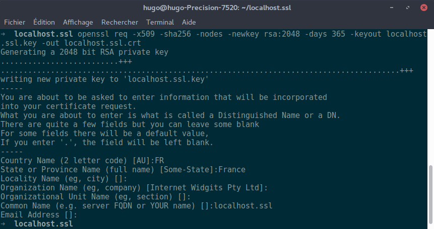

Solary
======

Projects related to the french WebTV [Solary](https://www.solary.fr).

* [Getting started](#getting-started)
  * [Requirements](#requirements)
  * [Bootstraping](#bootstraping)
  * [Server Bootstraping](#server-bootstraping)
* [Projects](#projects)
  * [Extension](#extension)
  * [Server &amp; Web UI](#server--web-ui)

Getting started
---------------

### Requirements

- Node.js 9+
- [yarn](https://yarnpkg.com/lang/en/docs/install/)
- [lerna](https://github.com/lerna/lerna) (installed globally)
- [pm2](https://github.com/Unitech/pm2) (installed globally)

### Bootstraping

Just run `lerna bootstrap`, it will install dependencies for all projects located inside `packages` folder.

### Server Bootstraping

You can ignore this part if you know that you won't work with a development server.

#### Set-up host
If you need to work on server, you will need to add `localhost.ssl` host in your `/etc/hosts`:

```
127.0.0.1 localhost.ssl
```

#### SSL certificate

- Generate a fake SSL certificate for the previously created host:

```bash
$ openssl req -x509 -sha256 -nodes -newkey rsa:2048 -days 365 -keyout localhost.ssl.key -out localhost.ssl.crt
```

**Be sure to specify `localhost.ssl` when it's asking for `Common Name (e.g. server FQDN or YOUR name)`**:



- Then copy the file `packages/server/config.js.default` to `packages/server/config.js`.

- Then edit the file `packages/server/config.js` and change `cert`/`key` values:

```js
module.exports = {
  cert: '/path/to/localhost.ssl.crt',
  key: '/path/to/localhost.ssl.key',
};
```

Projects
--------

### Extension

All builds are located [here](https://solary.kocal.fr/builds) (if I think to put them here...).

- [Extension for Chrome](https://chrome.google.com/webstore/detail/solary/hcbdbiggklmbnbhhmepnebffpmajnkai)
- [Extension for Firefox](https://solary.kocal.fr/builds/firefox/)
- _Extension for Opera_ (soon)
- _Extension for Edge_ (soon)

#### Commands

##### yarn build

Build the extension for **production**, in folder `dist`.

Production environment will **ONLY** listen WebSocket messages from `wss://solary.kocal.fr`.

##### yarn build:dev

Build the extension for **development**, in folder `dist`.

Development environment will **ONLY** listen WebSocket messages from `wss://localhost.ssl:3000`.

##### yarn watch

Watch any modifications and then run `yarn build`.

##### yarn watch:dev

Watch any modifications and then run `yarn build:dev`.

##### yarn build-zip

Generate a zip of the extension, e.g. `dist-zip/Solary-v1.X.X.zip`.

### Server & Web UI

In production, the web UI is accessible to `https://solary.kocal.fr`, protected by a `.htpasswd`.

In local, the web UI is accessible to `https://localhost.ssl:3000`, also protected by a `.htpasswd`.

Before running the server, you **MUST** [create a `.htpasswd` file](https://www.web2generators.com/apache-tools/htpasswd-generator), at the root of the server project.

#### Commands

##### yarn start

Run the server in **production** environment by using pm2.

##### yarn start:dev

Run the server in **development** environment by using pm2.
Useful for debugging. 

##### yarn stop

Stop the server.

